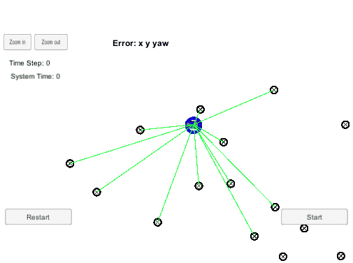

# CarND-Kidnapped-Vehicle-Project
Self-Driving Car Engineer Nanodegree Program


## Project Introduction
My robot has been kidnapped and transported to a new location! Luckily it has a map of this location, a (noisy) GPS estimate of its initial location, and lots of (noisy) sensor and control data.

In this project I will implement a 2 dimensional particle filter in C++. My particle filter will be given a map and some initial localization information (analogous to what a GPS would provide). At each time step my filter will also get observation and control data. 


## Dependencies
* ubuntu
 	* [Windows](https://www.howtogeek.com/249966/how-to-install-and-use-the-linux-bash-shell-on-windows-10/)
* cmake: 3.5
	* All OSes: [installation instructions](https://cmake.org/install/)
* make: 4.1 (Linux and Mac), 3.81 (Windows)
* gcc/g++: 5.4
* [uWebSocketIO](https://github.com/uWebSockets/uWebSockets)
	```
	git clone https://github.com/uWebSockets/uWebSockets 
	cd uWebSockets
	git checkout e94b6e1
	mkdir build
	cd build
	cmake ..
	make 
	sudo make install
	cd ../..
	sudo ln -s /usr/lib64/libuWS.so /usr/lib/libuWS.so
	sudo rm -r uWebSockets
	```
* [Term 2 Simulator](https://github.com/udacity/self-driving-car-sim/releases)
	* [Windows](https://drive.google.com/open?id=10J4N17bD7BhyW7ESzTaF_IUPveTBCZPn)

## Basic Build Instructions
Once the install for uWebSocketIO is complete, the main program can be built and run by doing the following from the project top directory.
1. Clone this repo.
2. Make a build directory: `mkdir build && cd build`
3. Compile: `cmake .. && make` 
   * On windows, you may need to run: `cmake .. -G "Unix Makefiles" && make`
4. Run it: `./particle_filter `

<div align=center></div>

## Communication Protocol

Here is the main protocol that main.cpp uses for uWebSocketIO in communicating with the simulator.

**INPUT**: values provided by the simulator to the c++ program

// sense noisy position data from the simulator

["sense_x"]

["sense_y"]

["sense_theta"]

// get the previous velocity and yaw rate to predict the particle's transitioned state

["previous_velocity"]

["previous_yawrate"]

// receive noisy observation data from the simulator, in a respective list of x/y values

["sense_observations_x"]

["sense_observations_y"]


**OUTPUT**: values provided by the c++ program to the simulator

// best particle values used for calculating the error evaluation

["best_particle_x"]

["best_particle_y"]

["best_particle_theta"]

//Optional message data used for debugging particle's sensing and associations

// for respective (x,y) sensed positions ID label

["best_particle_associations"]

// for respective (x,y) sensed positions

["best_particle_sense_x"] <= list of sensed x positions

["best_particle_sense_y"] <= list of sensed y positions


## Data
You can find the inputs to the particle filter in the `data` directory.

### The Map*
`map_data.txt` includes the position of landmarks (in meters) on an arbitrary Cartesian coordinate system. Each row has three columns
1. x position
2. y position
3. landmark id

### All other data the simulator provides, such as observations and controls.

> * Map data provided by 3D Mapping Solutions GmbH.


